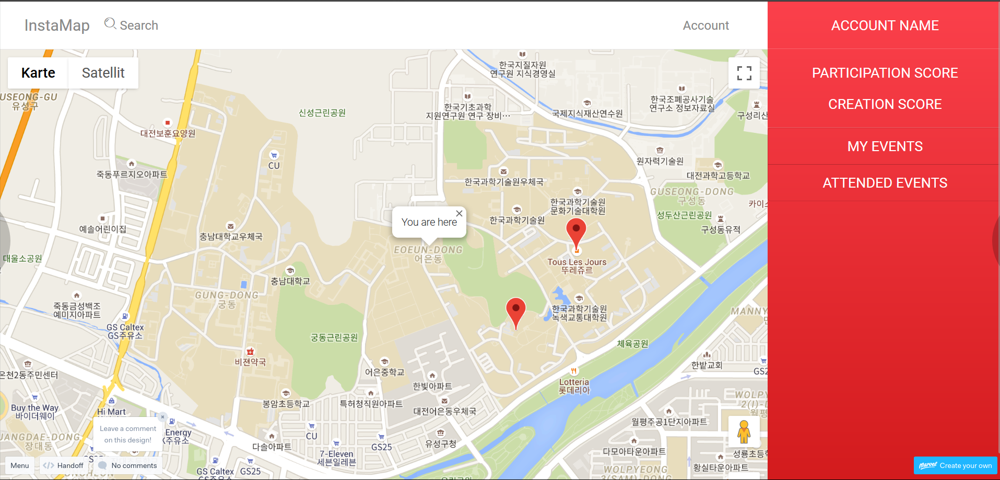

<h1>Low-Fi - InstaMap</h1>

<h3>Problem statement :</h3>

<ol>
<li>

There is no centralized platform to see and know what is happening right now on the campus of KAIST. (example : A concert in Auditorium, a special discount in Subway and a member of BTS in N1). 
</li>
<li>

For an event on the campus, it is difficult to predict how many people are interested about it or how many people are going to participate.
</li>
</ol>

<h3>Tasks:</h3>

<ul>
<li>
A user visiting our website will find around him, on a map, all the current events posted by the community. The events are represented with a simple red marker. This way, the user has a clear view of what is happening and where things are happening around.
</li>
<li>
A user who wants to post an event on our website can easily do it by choosing a location on the map, a name and a description for his/her event and then submit it instantly. The community using the website will be able to see it without refreshing their web browser. The user can also delete the event if she/he did a mistake or if the event is finished.
</li>
<li>
Users are able to click on a “I like it” button or a “I participate” button when clicking on a specific event. This way, the publisher of the event will be able to predict how many people are going to come or at least how many people are interested about his/her event.
</li>
</ul>

<h3>Prototypes :</h3>
<a href=https://marvelapp.com/9hcdb2g>Marvel Prototyp: https://marvelapp.com/9hcdb2g</a> 
<a href=https://marvelapp.com/9hcdb2g>Working Prototyp: https://instamap-1571822648090.web.app/</a> 
<a href=https://instamap-1571822648090.web.app/InstaMap/examples/maps.html>Firebase Prototyp: https://instamap-1571822648090.web.app/InstaMap/examples/maps.html/</a>

Give feedback about the prototype tool : 
<ul>
<li>
What did not work well :

<ul>
<li>
Using Google Maps API. That is why we preferred to show you our built app from JS and HTML, because everything was clearly implemented and easy to use. The map interaction can not be visualized in Marvel. However the voting system was easier to first build in Marvel since it involves more logic.

</li>
</ul></li>
<li>
What worked well : Showing things we are not sure to implement yet. This is better so we do not to work too much on code in the case we have to modify things later on. Also, it is nice to have an idea of how our website would look like before creating it.
</li>
</ul>

<h3>Design choices :</h3>
<ul>
<li>
Color red: for excitement and engagement of user.
</li>
<li>
Using the map as the central view to directly show the location and therefore make it easy for the user to filter for a location they like and can access.
</li>
<li>
Changing the “love” and “bullshit” button to “like” and “participate” due to more information for event manager. In combination with the ability to report events and users it is still sufficient quality control.
</li>
<li>
Changing size (and maybe color) of the map pin according to the interaction of other users with the event
</li>
</ul>

<h3>Screenshots :</h3>
<pre></pre>
<pre></pre>
<pre></pre>

<h3>Instruction :</h3>
OPENING OUR APP
<ol>
<li>
Please open the file InstaMap>Examples>index.html. You should open this page in your favorite browser from any machine (smartphone/computer) you want as our website was built responsive.
  
Note that you need an internet connection as we use Google Maps API.

</li>
<li>
If asked, please allow localization from your browser. Indeed, localizing you will zoom on your position, giving you information about events happening around you. If you refuse, you will be seeing the map of South Korea.
</li>
</ol>

LOOKING FOR EVENTS ON THE CAMPUS
<ol>
<li>
You should be able to see events on KAIST Campus as we provided some examples from our Database. If you don’t see them, no worries, just zoom out a little. The events are represented by red markers.
</li>
<li>
Now that you see some events on the map, just click on one of them to have more informations about it : An Info Window will appear on top of it and will provide you the Name and Description of the event. Now you know what is happening there ! Great, isn’t it ?
</li>
</ol>
SHARING YOUR EVENT ON THE MAP
<ol>
<li>
Now, let’s add an event on the map ! Imagine you are selling homemade cookies and you want to share this information to the community to have more customers coming. It is easy : just double-click on the map. A little blue marker should appear. Now, drag this event on the precise location where you are selling the cookies. 
</li>
<li>
Now that your blue marker is on the correct location, you need to provide more informations to your potential future customers. Simply add a name and description of your event in the form below the map. For example 

<ol>
<li>
Name : Selling Homemade Cookies
</li>
<li>
Description : delicious chocolate cookies, 1k won each 
</li>
</ol></li>
<li>
Now that we have our blue marker on our selling position and that we gave all the informations about the event let’s press the « ADD EVENT » button.
</li>
<li>
Now, your event has turned red and is online. Everyone can see it on the map. Bravo !
</li>
</ol>
DELETE AN EVENT
<ol>
<li>
Oops… You made a mistake on your previous event. Or maybe you don’t have cookies anymore and want to inform your customers that the event is over. No worries ! Just click on your event and press the « DELETE EVENT » button at the bottom of the page to delete it.

<ol>
<li>
 If you did a mistake then just create another event !
</li>
</ol></li>
</ol>

IMPORTANT REMARKS : our website is not secured yet. Then, please only add a few events only and avoid deleting markers that were not created by you. Please do not share our application with other people yet (the class for example) as we will face critical problems. Thank you!

<strong>Observations from our 3 users (P1,P2 and P3 - fictive) (at least 10 observations) :</strong>
<ul>
<li>
P1,P2,P3 : I can delete an event that I did not create, is it normal ?

Criticality : VERY HIGH (security)
<ul><li>
We allow this feature for our demo version. Later, we are going to implement User Accounts to tackle this problem. Indeed, we will have two type of sessions : running InstaMap with a user account or with an anonymous session. The anonymous session will only be able to see events. The user account will be able to create and delete its events and use the ‘I like’ - ’I Participate’ buttons on others events.
</li></ul>
</li>

<li>
P1,P3 : How can you manage trolling/spamming ? I am asking this question because I noticed that I can create a lot and lot of fake events on the map.

Criticality : HIGH (security)
<ul><li>
First, to tackle the spamming problem we will use ReCaptcha on registration. This way, bots will not be able to create fake accounts and then share spam events on the map. Secondly, we also have to fix the problem of trolling. We will implement three things against that :

<ul>
<li>Building a Reputation System : this way visitors could choose to filter events by showing « Trusted Users »’ events only. This will help them to have a clearer view of what is happening on the map. This reputation system will be built thanks to the ‘I like’-’I Participate’ feedback of users. The more people like and come to your events, the more you will become a “Trusted User”.</li>
<li>Restricting/Punishing users with a bad reputation. We are thinking about creating a “report this user” button for people who participated to user’s event. This way, if many people from an event reported the user, then the future events of this user will be warned with a “Be careful if you wish to attend this event : this user has been reported before”. This way, people will be warned about suspect users.</li>
<li>Limiting the number of events you can create per day as a « Non-Trusted User ». 2 maximum for example to limit the spread of fake/malicious events.</li>
</ul>
</li></ul>

</li>

<li>
P1,P2,P3 : The idea of your website is nice but how are you going to attract people to share events and go to events ? Because it looks like you need a certain amount of users to make your platform work well.

Criticality : HIGH (marketing/attract visitors)
<ul><li>
First we are planning to advertise our app thanks to the Social Computing class students. Then we will try as much as possible to share events we see on the campus in order to make our website useful. As is might not be enough, we want to ask shops on KAIST campus to offer special discounts to students who came thanks to our website. It will be great for the shops because they will attract more customers than usual. For us, this will attract more visitors on our website. Then, as the number of visitors on our website increases, we will launch the pro accounts to give more credit to KAIST university events, associations events, shops events etc. 
</li></ul>
</li>
<li>
P1,P2,P3 : I struggle with events and their validity thought time :  it is not easy to know when an event occurs, when it was created and when it expires.

Criticality : HIGH (user experience)
<ul><li>
To tackle this issue we will use a timer for each event. This way, users can know when the event was created and when it will expire. User who create new events will have to tell how long they want their event to be shown on the map. People will have to choose from a duration between 1 minute minimum and 24 hours maximum. Then, when the timer expires the event will be automatically deleted. Note that we don’t want to have events that last more than 24 hours for memory reason. Indeed, we want our app to stay free but large memory costs some money.
</li></ul>
</li>

<li>
P3: Oh I can upvote the event I just created. 1,2,3,4,5,6….

Critically: HIGH (security)
<ul><li>
Together with other account bound things. The voting has to be regulated to only once per user and not on their own events. They will be participating by default.
</li></ul>
</li>

<li>
P2 : If there are too many events on the map, how can I know about them without clicking on all of them ? Because I find it difficult to have a big picture of events with only red markers. I have no idea what they represent.

Criticality : NORMAL (user experience)
<ul>
<li>
We will tackle this problem with 3 solutions :

<ul>
<li>
We will provide a short title on top of the marker without you having to click on it. 
</li>
<li>
We will also implement Tagging at events’ creation. We will then implement a search bar for you : if you are searching for « food » or « music » then we will only show the events with such a Tag. Moreover we will be able to show the events with an appropriate marker instead of only red markers so you can easily have a big picture of the events’ category without having to search in the search bar. For example, ‘restaurant’ tagged event will show a knife and fork instead of a red marker.

</li>
<li>
Thanks to the ‘I like’-’I Participate’ buttons we will highlight the most popular events so you don’t have to struggle finding something good/relevant around you (the marker will appear bigger for example).

</li></ul>
</li></ul>
</li>

<li>
P3 : How can I create a new event? Long pressing? Oh no double tap.

Criticality: Normal (user experience)
<ul>
<li>
We need to find out what the broadly known standard is or create a button for creating new events.
</li>
</ul>
</li>

<li>
P2 : Thank you for your answer, but then, what about events that have to last more than 24 hours ? If you want to promote a 1 week festival, will you have to share an event everyday for 1 week ?

Criticality : LOW (user experience)
<ul>
<li>
For this type of long-term events, users are usually professionals or associations (for the festival for example). We will provide paying pro accounts to these type of users. Thanks to a Pro account they will have more freedom and will be able to user extra features like a Personalized Approved Marker. For example, KAIST could have its own Approved Marker. This way, when KAIST adds an event, people will be able to see it more easily on the map and could trust the event.
</li>
</ul>
</li>

<li>
P2,P3: The moving of the map  with two fingers is not intuitive I want to use only one finger as usally.

Criticality: NORMAL (user experience)
<ul>
<li>
This is  a problem specific on smartphones and depends on the google API we are using. We have to see how much we can modify this content.
</li>

</ul>
</li>

<li>
P1,P2 : What about a different color for my events displayed on the map ? Otherwise it is difficult to remember which events are mine on when looking at a map full of markers.

Criticality : NORMAL  (user experience)
<ul>
<li>
We will display the user’s markers with a different color when we will add the User Accounts. It will be like that soon but it is a great idea, thank you !
</li>
</ul>
</li>

</ul>

